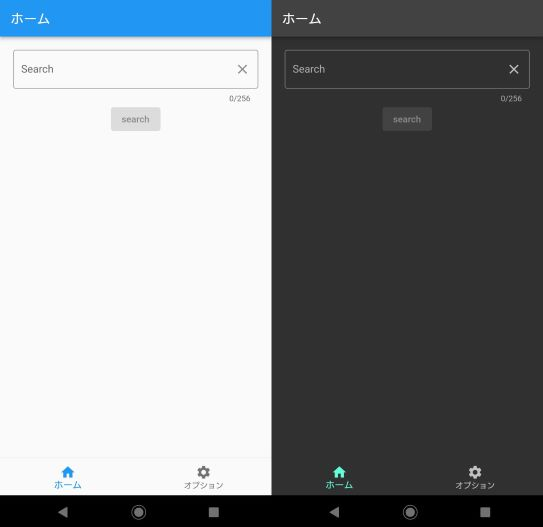
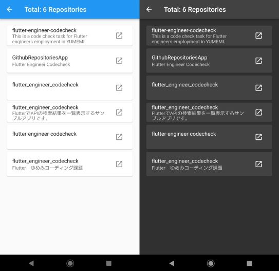
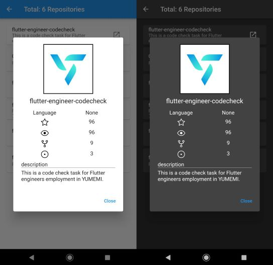
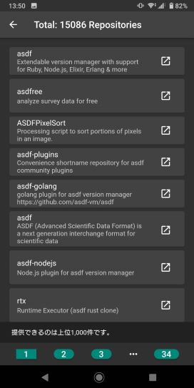

<p align="center">

</p>

<p align="center">
<b>RepositoriesSearcher</b>
</p>

## 概要
本アプリケーションはGithub上のリポジトリを検索するflutterアプリケーションです。

## 機能

### 検索
>- リポジトリ名での検索機能(1検索あたり、最大1,000件の検索結果を提供)
>- 検索時のソート、1ページ当たりの表示数の設定
>- ページネーション

### 表示
>- ダークモード
>- 詳細画面でのスター、ウォッチ数等の表示
>- Githubのリポジトリページへのアクセス

## ギャラリー
- ホーム画面



- 検索結果



- 詳細表示



- 設定画面


- 検索結果が1ページに収まらない場合はページネーションを実装



## 使用パッケージ等

### dependencies

パッケージ|用途
-- | -- 
http | httpリクエストの実施
hooks_riverpod | 状態管理ライブラリ
flutter_hooks | ステート管理
riverpod_annotation | コードの自動生成
yaml | コンフィグファイルの読み込み
flutter_svg | SVGの使用
path | パス操作
url_launcher | 外部ページ遷移

### dev_dependencies

パッケージ|用途
-- | -- 
build_runner | コードの自動生成
riverpod_generator | プロバイダの自動生成
flutter_launcher_icons | アプリアイコン設定補助

## アプリケーションの技術的特徴
- StatefulWidget不使用
- ページネーションの自作
- アプリケーションアイコンの作成

<hr>

## Getting Started

### 1. このリポジトリのクローン

```sh
git clone https://github.com/GawinGowin/RepositoriesSearcher
```

### 2. コンフィグファイルの用意[Githubのトークンがある場合]

#### 2.1 ファイルをコピーする


```bash
cp .example.config.yaml .config.yaml
```

#### 2.2 `config.yaml` の記入

```yaml title=".config.yaml"
"Authorization": "Bearer <YOUR-TOKEN>"
```
**personal access token** もしくは **GitHub App user access token**  を `<YOUR-TOKEN>` に記入

### 3. アプリの実行

```sh
flutter pub get
flutter run
```
