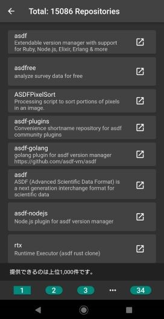

# RepositoriesSearcher


## 概要
本アプリケーションはGithub上のリポジトリを検索するflutterアプリケーションです。

## 機能

### 検索
>- リポジトリ名での検索機能
>- 検索時のソート、1ページ当たりの表示数の設定
>- ページネーション

### 表示
>- ダークモード
>- 詳細画面でのスター、ウォッチ数等の表示
>- Githubのリポジトリページへのアクセス

## 画像
- ホーム画面


- 検索結果


- 詳細表示


- 設定画面


- 検索結果が1ページに収まらない場合はページネーションを実装



<hr>

## Getting Started

### 1. このリポジトリのクローン

```sh
git clone https://github.com/GawinGowin/RepositoriesSearcher
```

### 2. コンフィグファイルの用意[Githubのトークンがある場合]

#### 2.1 ファイルをコピーする


```bash
cp .example.config.yaml .config.yaml
```

#### 2.2 `config.yaml` の記入

```yaml title=".config.yaml"
"Authorization": "Bearer <YOUR-TOKEN>"
```
**personal access token** もしくは **GitHub App user access token**  を `<YOUR-TOKEN>` に記入

### 3. アプリの実行

```sh
flutter pub get
flutter run
```
